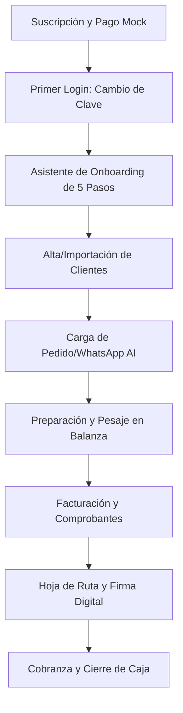

# Manual de Uso: Flujo Operativo y Plataforma ERPERIA

Este manual describe el funcionamiento global de **ERPERIA**, abarcando desde la suscripción inicial autogestionada (Trial de 30 días) y el asistente de bienvenida (Onboarding), hasta la administración SaaS global y el flujo logístico/operativo diario de la empresa.

---

## 1. Diagrama del Flujo Operativo Principal

---

## 2. Suscripción y Onboarding de Nuevos Tenants (Self-Service)

**ERPERIA** permite a cualquier negocio registrarse y comenzar una prueba gratuita de 30 días de forma totalmente autónoma.

### Paso A: Registro Inicial (`/signup`)
1. El usuario accede desde la página de inicio presionando **"Empezar 30 días gratis"**.
2. Completa el formulario de registro con la Razón Social, Cuit, Teléfono, Email del administrador y una paleta de color personalizada para su marca.

### Paso B: Simulación de Despliegue en la Nube
Tras enviar el formulario, se inicia una consola interactiva en tiempo real que simula el aprovisionamiento de la infraestructura:
- Creación de base de datos dedicada y aislamiento de esquemas.
- Semillado de la estructura fundamental del ERP.
- Configuración de la cuenta administradora maestra.

### Paso C: Pasarela de Pago e Inicio del Período de Prueba
- Para activar el trial, el usuario ingresa su tarjeta en una pasarela de pago simulada 3D premium.
- No se realizan cargos reales. Comienza una cuenta regresiva estricta de 30 días.
- Al finalizar el aprovisionamiento, se muestran las credenciales provisorias del administrador:
  - **Usuario**: `sysadmin@%slug_empresa%.com.ar`
  - **Contraseña**: `admin123`

---

## 3. Seguridad de Inicio y Onboarding de Bienvenida

### Overlay Bloqueante de Cambio de Contraseña
Al iniciar sesión por primera vez con la clave provisional `admin123`, se muestra un overlay translúcido bloqueante (`backdrop-blur`) que exige al administrador cambiar su contraseña antes de poder operar.
- **Requisitos de seguridad**: Mínimo 8 caracteres y coincidencia exacta en la confirmación.
- Una vez actualizada la clave, el flag `debe_cambiar_password` se desactiva en el backend.

### Asistente de Configuración Inicial (Wizard de 5 Pasos)
Si el tenant es nuevo (`onboarding_completado = False`), el sistema redirige de forma forzada al usuario a `/onboarding`, bloqueando el acceso a otros módulos hasta completar la configuración:

1. **Paso 1: Ficha Comercial**: Confirmación de la Razón Social, CUIT, Dirección, Teléfono, Correo y ajuste del color hexadecimal de branding corporativo.
2. **Paso 2: Mi Equipo**: Permite registrar las primeras cuentas para colaboradores asignando roles operativos clave:
   - `ADMINISTRATIVO`, `VENDEDOR`, `REPARTIDOR`, `DESPACHANTE`, `PRODUCCION`.
3. **Paso 3: Catálogo de Productos (CSV)**: Descarga de plantilla CSV estándar e importación masiva de artículos. El procesador limpia datos anteriores e inicializa la lista de precios minorista automáticamente.
4. **Paso 4: Cartera de Clientes (CSV)**: Descarga de plantilla CSV e importación masiva de clientes. Configura automáticamente sus cuentas corrientes inicializadas en cero y límites de crédito asignados.
5. **Paso 5: Lanzamiento**: El usuario confirma y finaliza presionando **"Comenzar a Operar en ERPERIA"**. Esto sella el estado de onboarding a `True` y habilita el acceso completo al Dashboard.

---

## 4. Control de Trial y Autogestión (Zona de Peligro)

### Cuenta Regresiva y Banner Superior
Los tenants en período de prueba visualizan un banner persistente en la parte superior del Dashboard indicando los días restantes de trial.
- Si quedan **5 días o menos**, el banner cambia a color rojo de alerta crítica con una animación intermitente y un icono de advertencia (`AlertTriangle`), instando a regularizar o decidir la continuidad de sus datos.

### Zona de Peligro: Autopurga de Datos
Si el administrador decide no continuar con la plataforma, puede dar de baja su empresa de manera autónoma para proteger su privacidad:
1. Dirigirse a `Configuración > Zona de Peligro` (panel inferior).
2. Leer la advertencia de irreversibilidad.
3. Presionar el botón rojo e ingresar la frase exacta `"ELIMINAR MI EMPRESA"`.
4. El backend ejecutará una purga relacional transaccional completa en cascada, eliminando absolutamente toda la información, usuarios y registros del tenant en la base de datos PostgreSQL, finalizando la sesión de inmediato.

---

## 5. Administración Global SaaS (`/platform`)

Restringido exclusivamente a usuarios con rol `SUPERADMIN` global. Permite supervisar el ecosistema de tenants en la plataforma.

### Listado y Gestión de Empresas
- Visualización en tiempo real del CUIT, estado de activación, y fecha límite del período de prueba.
- Visualización de estadísticas del tenant (cantidad de usuarios, pedidos y clientes).

### Remoción de Usuarios de Tenants
- Dentro del detalle de un Tenant específico, el administrador SaaS puede desvincular de forma permanente a cualquier usuario problemático o inactivo mediante un botón de eliminación (`Trash2`) con confirmación segura.

### Eliminación Completa de Tenants (Purga SaaS)
Para dar de baja un cliente comercial de manera definitiva, el administrador SaaS puede ejecutar una purga completa:
- **Protección**: El **Tenant Demo (ID 1)** se encuentra bloqueado a nivel de base de datos y UI; es imposible eliminarlo.
- **Validación de doble factor**: Para purgar cualquier otro tenant, el administrador debe escribir exactamente la Razón Social del Tenant.
- **Cascada Transaccional**: El sistema realiza el borrado de registros respetando un orden estricto de dependencias para evitar colisiones de claves foráneas:
  `Movimientos de Caja` $\rightarrow$ `Cajas Diarias` $\rightarrow$ `Movimientos de Cuenta Corriente` $\rightarrow$ `Cuentas Corrientes` $\rightarrow$ `Comprobantes` $\rightarrow$ `Bultos de Preparación` $\rightarrow$ `Órdenes de Preparación` $\rightarrow$ `Ítems de Pedidos` $\rightarrow$ `Pedidos` $\rightarrow$ `Rutas` $\rightarrow$ `Listas de Precios` $\rightarrow$ `Productos` $\rightarrow$ `Clientes` $\rightarrow$ `Usuarios` $\rightarrow$ `Configuración de Sistema` $\rightarrow$ `Tenant`.

---

## 6. Operación Diaria (Flujo ERP)

### Paso 1: Gestión de Pedidos (Tradicional y WhatsApp AI)
- **Carga Tradicional**: En `Ventas > Pedidos`, se asocian ítems a un cliente y se especifica la cantidad estimada (unidades o piezas).
- **Asistente de WhatsApp (Baileys + GPT-4o)**:
  - Vincula tu línea escaneando el código QR generado en los logs del servicio `whatsapp-bot`.
  - El bot procesa los mensajes entrantes interpretando lenguaje natural (ej: *"necesito 3 cajas de pechito y 20kg de bondiola"*).
  - Los pedidos detectados se listan en el Dashboard como **"Pendientes de Validación"**. El administrador revisa la coincidencia y valida el pedido para ingresarlo al circuito formal de pesaje con un solo clic.

### Paso 2: Preparación y Balanza (kilos exactos)
Los pedidos autorizados pasan a preparación. El operario selecciona la orden y asocia cada bulto al peso real registrado en balanza:
- Se cargan los kilos exactos de cada artículo pesado.
- El pedido cambia a estado **Preparado**.

### Paso 3: Facturación e Impresión de Comprobantes
En el panel de facturación, se seleccionan las órdenes listas para generar:
- **Factura Electrónica (AFIP)** o **Remito Interno de Entrega**.
- El total facturado se liquida en base a los kilos reales registrados en el paso anterior.
- Si el cliente posee cuenta corriente autorizada, el saldo deudor se incrementa automáticamente respetando su límite crediticio.

### Paso 4: Logística (Hoja de Ruta y Despacho)
El despachante agrupa pedidos preparados en rutas específicas. El chofer asignado accede al módulo móvil para:
- Visualizar el orden de entrega.
- Marcar la recepción conforme por parte del cliente.
- Capturar la **Firma Digital** directamente en la pantalla de su dispositivo móvil al entregar la mercadería.

---

> [!TIP]
> Monitorea el **Dashboard de ERPERIA** para evaluar el rendimiento logístico diario, el estado de los repartos en tiempo real, el nivel de cobranza en cuenta corriente y las ventas totales.
